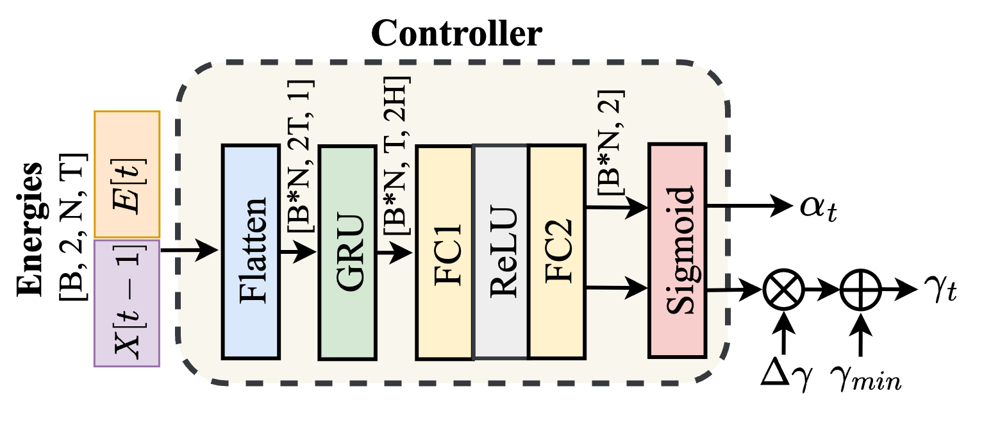

# Adaptive Per-Channel Energy Normalisation Front-end for Robust Audio Signal Processing

The Official Implementation of ICASSP2026 submission of LEAF-APCEN paper. Including all experiments and analysis in the paper.

## About LEAF-APCEN
The LEAF-APCEN is a novel adaptive front-end based on LEAF with simplified PCEN that tune the two parameters in PCEN by an adaptive neural controller as shown in the figures below.

## Model Architecture


## Neural Adaptive Controller


## Usage

## Requirements

- torch >= 2.7.0
- torchaudio == 2.7.0
- efficientnet_pytorch
- numpy == 1.26.4
- matplotlib == 3.9.2
- pandas == 2.2.2
- tqdm
- omegaconf
- hydra-core
- librosa
- soundfile
- scipy

Install all dependencies with:

```bash
pip install -r requirements.txt
```
### Training
First edit `config.yaml` to set dataset, frontend, and training parameters. Note that if you use complex dataset, you should set the dynamic in config.yaml as True, and set the data_type as clean.

The Run training with:
```bash
python main.py
```

### Inference & Analysis
- Use `result_analysis/plot_representation/load_analysis_adaptive.py`, `result_analysis/plot_representation/load_analysis_learnable.py`, etc., to extract and visualize filterbank and PCEN representations (corresponding to Fig.5 in the paper).
